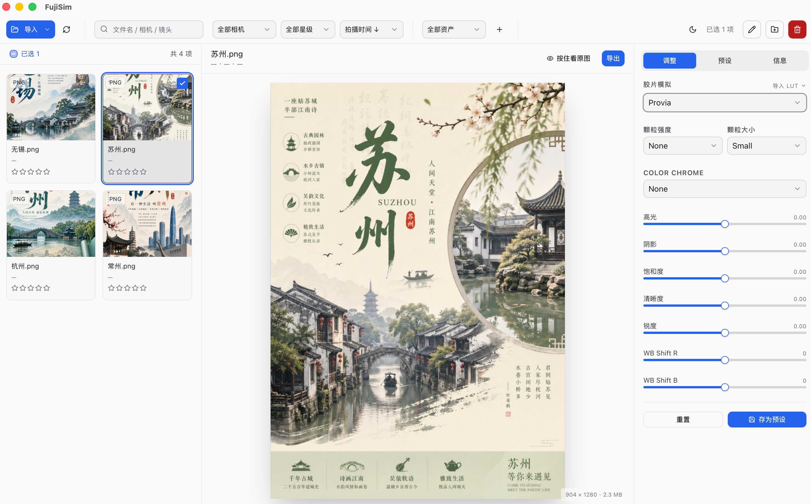

#  FujiSim

[English](../README.md) | [中文](README_zh.md)

> 高保真富士胶片模拟桌面应用（MVP 阶段：全量 P0 + P1 + P2 核心特性已实现，RAW 解码预留接口）

[](#)
[](#)
[](#)
[](#)
[](#)
[](#)

基于 **Tauri 2 + Rust + React 18 + TypeScript + Tailwind + SQLite** 的跨平台桌面应用，实现资产管理、富士胶片模拟、批量导出等功能。



---

## ✨ 已实现功能

### 📁 F1 资产管理
- **智能导入**：支持**选择目录**（递归扫描）和**批量选择文件**两种导入方式，支持导入 JPEG / PNG / TIFF / HEIF（RAW 接口已预留）
- **相册感知导入**：在某个相册视图下触发导入时，新资产自动关联到当前相册，无需手动添加
- **Exif 解析**：自动提取 相机 / 镜头 / ISO / 光圈 / 快门 / 焦距 / 拍摄时间 等元数据
- **极速视图**：网格视图（懒加载缩略图展示）与详细信息面板结合
- **多维筛选**：支持按 相机、星级、排序、相册 及 全文搜索 进行资产筛选
- **便捷整理**：支持星级（0-5）打分，支持虚拟相册的创建、归类和删除
- **批量选择体验**：每张缩略图右上角配备复选框（hover 显现，已选则常驻），列表头部提供"全选/取消全选"按钮，并以三态指示当前选中状态（无 / 部分 / 全部）；同时保留 Cmd/Ctrl 多选与 Shift 区间选择
- **选中态自愈**：删除/移动/筛选后，`selectedIds` 会自动收敛到新列表的有效子集，`focusedId` 优先回退到仍在选中集合中的下一张资产，画布永不空白

### 🛠️ F2 文件操作
- **批量重命名**：支持灵活的占位符变量（如 `{date}_{camera}_{name}`）
- **加入相册**（原"批量移动"）：在弹窗中以下拉框枚举相册列表，将选中资产加入目标相册；若当前正处于某相册视图下，会同步从原相册移除，达到真正的"跨相册移动"语义；全程不动物理文件
- **安全删除**：提供"仅移除记录"与"移入系统回收站"两种删除模式

### 🎨 F3 核心色彩引擎（富士胶片模拟）
- **内置 13 款经典富士胶片模拟**：
  Provia / Velvia / Astia / Classic Chrome / Pro Neg.Std / Pro Neg.Hi / Eterna / Classic Neg / Nostalgic Neg / Acros (+Y/+R) / Monochrome
- **胶片模拟分组下拉**：系统预设（13 款内置富士配方）与用户自定义（已导入的 3D LUT）分组展示，统一在同一下拉框中选择
- **用户 3D LUT 库**：支持批量导入 `.cube` 格式 LUT，导入时自动复制到应用数据目录（`<data_dir>/luts/`），源文件移动/删除不影响应用；支持选择文件（批量多选）和选择目录（递归扫描）两种导入方式
- **LUT 绕过模式**：选中用户 LUT 时自动切换为 Pass-Through 配方，跳过富士曲线/Split Toning/饱和度等步骤，仅走用户滑块调整 + LUT 三线性查色
- **程序化色彩配方**：分通道曲线弯折 + Split toning + 饱和度 + 色相位移 + 褪色
- **颗粒感模拟**：支持多档强度（None / Weak / Medium / Strong）与颗粒粗细（Small / Large）
- **Color Chrome 效果**：增加色彩深度（None / Weak / Strong）
- **高阶调色面板**：支持高光 / 阴影 / 饱和度 / 清晰度 / 锐度调节，以及白平衡偏移（R 轴 / B 轴，-9 到 +9）
- **预设管理**：用户自定义预设 CRUD，内置预设独立保护；预设标签页同步展示系统预设与用户自定义（含 LUT 条目）
- **实时预览**：80ms 防抖响应，长边 1280 硬件级缩放，支持 A/B 视图对比（按住按钮即刻查看原图）

### 📤 F4 批量生成与导出
- **可控并发**：后台异步多线程批量导出，使用专用 `rayon::ThreadPool` 把"同时进入流水线的大图数量"硬卡在 **2 张**；图内仍走像素级并行，多核 CPU 跑满，但峰值内存可预测（6000×4000 RAW 约 1.4 GB，而非 CPU 核心数 × 单图内存）
- **多格式支持**：导出为 JPEG（质量可调）、PNG、TIFF、WebP
- **导出管理**：可选择导出至原目录的子文件夹或全局自定义路径
- **灵活缩放**：支持 保持原始尺寸、按长边等比缩放、按百分比缩放
- **实时追踪**：通过 Tauri Events 将导出进度实时推送到前端 UI

### 🧹 F5 数据与生命周期治理
- **进程内 LUT 缓存**：每个 `.cube` 文件解析一次后由 `Arc` 共享，预览拖滑块、批量导出 1000 张共用同一份内存数据，永远不会重复读盘；删除用户 LUT 时同步清除缓存
- **流式内存峰值**：预览流水线在每一阶段完成后立即 drop 上一阶段的中间缓冲（源图 / resize / 处理后）—— 渲染单张大图时内存不会同时驻留多份大缓冲
- **事件监听器安全**：前端 `listen()` 注册采用 `cancelled` 标志兜底，处理"组件卸载早于 Promise resolve"的竞态，杜绝监听器泄漏与"对已卸载组件 setState"
- **`reset_app_data` IPC**：单次调用关闭 SQLite 连接池（释放 `library.db-wal` / `-shm` 句柄）→ 清空内存 LUT 缓存 → 递归删除整个 `Application Support/FujiSim/` 目录。可用于"重置应用"按钮，或集成到卸载脚本中保证零残留

---

## 🏗️ 工程架构

```text
├── docs/                          # README_zh.md
├── public/                        # images
├── src/                           # React 前端
│   ├── components/                # 业务 UI 组件
│   │   ├── ui/                    # 基础组件库 (shadcn/ui 风格)
│   │   │   ├── dropdown-menu.tsx  # 下拉菜单（导入方式选择）
│   │   │   └── ...                # button / dialog / select / slider / tabs
│   │   ├── Sidebar.tsx            # 顶部操作栏（导入/筛选/相册/批操作）
│   │   ├── AssetGrid.tsx          # 素材列表（卡片网格视图）
│   │   ├── PreviewPanel.tsx       # 中央画布（图片预览及 A/B 对比）
│   │   ├── FilterPanel.tsx        # 右侧操作区（参数调整与元信息展示）
│   │   ├── ExportDialog.tsx       # 批量导出配置弹窗
│   │   └── StarRating.tsx         # 星级评定组件
│   ├── api.ts                     # Tauri IPC 命令封装
│   ├── store.ts                   # Zustand 全局状态管理
│   ├── types.ts                   # 前后端共享的 TS 类型定义
│   └── App.tsx                    # 顶层应用布局
├── src-tauri/                     # Rust 后端引擎
│   ├── src/
│   │   ├── lib.rs                 # Tauri Builder 入口
│   │   ├── ipc.rs                 # 28 个 #[tauri::command] API 接口
│   │   ├── state.rs               # AppState（DB 连接池、LUT 缓存、导出 ThreadPool）+ 内置预设初始化
│   │   ├── error.rs               # 自定义 Error 层
│   │   ├── db/                    # SQLite 数据库持久层 (连接池 + Schema)
│   │   │   └── user_luts.rs       # 用户 3D LUT 库 CRUD
│   │   ├── asset/                 # 目录扫描、文件列表扫描、Exif 解析、文件系统操作
│   │   ├── processing/            # 核心色彩引擎流水线 (fuji预设, 曲线, LUT)
│   │   └── export/                # 异步导出与水印压制模块
│   └── Cargo.toml                 # Rust 依赖清单
└── package.json                   # 前端依赖及启动脚本
```

---

## 💾 数据库位置

应用程序的 SQLite 数据库默认存储在：
- **macOS**: `~/Library/Application Support/FujiSim/library.db`

用户导入的 3D LUT 副本存储在：
- **macOS**: `~/Library/Application Support/FujiSim/luts/`

> ⚠️ 首次启动应用时，系统会自动建表并写入 13 个内置的富士胶片预设。

---

## 🚀 快速启动

1. **安装前端依赖**（首次使用）
   ```bash
   pnpm install
   ```

2. **启动开发模式**（Vite 热更新 + Tauri 监视器）
   ```bash
   pnpm tauri dev
   ```

> 💡 **提示**：首次执行 `cargo build` 需要编译 600+ 个 crate，可能耗时 2-3 分钟。之后的增量编译将非常迅速，通常在数秒内完成。

---

## 📦 打包发布

### 前置准备

首次打包前需要为 Rust 添加对应平台的编译目标：

```bash
rustup target add aarch64-apple-darwin      # macOS Apple Silicon (M 系列)
rustup target add x86_64-apple-darwin       # macOS Intel（Universal Binary 也需要）
rustup target add x86_64-pc-windows-msvc    # Windows x64（仅在 Windows 环境下有效）
```

### 打包命令

| 命令 | 产物 | 说明 |
|---|---|---|
| `pnpm build:mac-arm` | `.dmg` (arm64) | Apple Silicon 专用，M1/M2/M3/M4 |
| `pnpm build:mac-x64` | `.dmg` (x86_64) | Intel Mac 专用 |
| `pnpm build:mac` | `.dmg` (Universal) | 单包同时支持 arm64 + x86_64（fat binary，体积更大） |
| `pnpm build:win` | `.msi` / `.exe` | Windows x64，需在 Windows 环境执行 |

```bash
# 示例：在 Apple Silicon Mac 上打包
pnpm build:mac-arm

# 打 Universal Binary（一份包通吃 Intel + Apple Silicon）
pnpm build:mac
```

### 产物输出目录

所有打包产物统一输出到仓库根目录的 `target/<target>/release/bundle/` 下（workspace 模式，**不是** `src-tauri/target/`）。具体路径如下：

| 命令 | `.app` / 可执行文件 | 安装包 |
|---|---|---|
| `pnpm build:mac-arm` | `target/aarch64-apple-darwin/release/bundle/macos/FujiSim.app` | `target/aarch64-apple-darwin/release/bundle/dmg/FujiSim_<版本>_aarch64.dmg` |
| `pnpm build:mac-x64` | `target/x86_64-apple-darwin/release/bundle/macos/FujiSim.app` | `target/x86_64-apple-darwin/release/bundle/dmg/FujiSim_<版本>_x64.dmg` |
| `pnpm build:mac` | `target/universal-apple-darwin/release/bundle/macos/FujiSim.app` | `target/universal-apple-darwin/release/bundle/dmg/FujiSim_<版本>_universal.dmg` |
| `pnpm build:win` | `target/x86_64-pc-windows-msvc/release/FujiSim.exe` | `target/x86_64-pc-windows-msvc/release/bundle/msi/FujiSim_<版本>_x64_en-US.msi`<br>`target/x86_64-pc-windows-msvc/release/bundle/nsis/FujiSim_<版本>_x64-setup.exe` |

> 💡 文件名里的 `<版本>` 取自 [tauri.conf.json](../src-tauri/tauri.conf.json) 中的 `version` 字段，当前是 `1.0.1`。

### 注意事项

- **Windows 交叉编译**：Tauri 不支持从 macOS 交叉编译到 Windows，`build:win` 需在 Windows 机器或 CI 环境（如 GitHub Actions）中运行。
- **Universal Binary**：`build:mac` 内部会分别编译 arm64 与 x86_64，再用 `lipo` 合并为单一 fat binary，耗时约为单架构的两倍，产物体积也接近两倍。如需更快出包或更小体积，请改用 `build:mac-arm` / `build:mac-x64`。
- **代码签名**：发布前建议配置 `tauri.conf.json` 中的 `bundle.macOS.signingIdentity` 和 `bundle.windows.certificateThumbprint`，否则系统可能弹出安全警告。
- **清理产物**：`target/` 目录在 `.gitignore` 中已忽略；如需腾出磁盘空间，可手动 `rm -rf target/`，下次打包会重新编译。

---

## 🔧 RAW 解码接入指南 (下一步)

当前后端 `src-tauri/src/processing/raw.rs` 已经预留了 `decode_raw_rgb16` 接口，由于处于 MVP 阶段，目前会返回 `Unsupported`。如需接入 RAW，只需：
1. `brew install libraw` (安装底层解码库)
2. 在 `Cargo.toml` 中增加 `libraw-rs = "0.0.4"` 或 `rawloader = "0.37"`
3. 在 `raw.rs` 中实现解码逻辑：RAW → 线性 16-bit RGB → Bayer 去马赛克 → Camera WB
4. 后续流程已由 `processing::load_image_rgb16` 自动接管，色彩管线无需改动！

---

## 📌 已知 MVP 阶段限制

- RAW 解码尚未正式启用（按照 MVP 需求优先级暂缓开发）
- 完整 Exif 信息写回到新文件的功能未实现（目前仅在 UI 提供 "移除 GPS" 开关）
- 16-bit TIFF 格式的多通道导出目前暂降为 8-bit（但内存中的色彩引擎流水线仍保持全程 16-bit 处理）

---

## 💎 技术亮点

- ⚡️ **全链路 16-bit 精度**：解码 → 曲线 → 色彩映射 → 颗粒处理 全程采用 `f32` 高精度浮点计算，只在最后一步保存时转换到 `u16/u8`，最大程度避免色彩断层。
- ⚡️ **受控的 rayon 并行**：批量导出使用专用 2 线程 `rayon::ThreadPool`，把大图同时入流水线的数量硬卡住，峰值内存可预测；单图内部仍走像素级并行，多核 CPU 跑满。
- ⚡️ **防抖式实时渲染**：拖动滑块时前端应用 `80ms` 输入合并防抖，完美避免 UI 卡顿并防止后端过载。
- ⚡️ **进程内 LUT 缓存**：解析后的 `.cube` 通过 `Arc` 共享，预览与批量导出共用一份内存数据 —— 拖滑块、导出千张图都只会读盘一次。
- ⚡️ **零外部 C/C++ 依赖**：纯血 Rust 实现（MVP 阶段），安装即编译，编译即刻运行，告别繁琐的环境配置。
- ⚡️ **干净的卸载路径**：`reset_app_data` 命令关闭连接池 → 清空内存缓存 → 删除整个数据目录，可直接接入"应用重置"按钮，也可被打包到卸载脚本中。